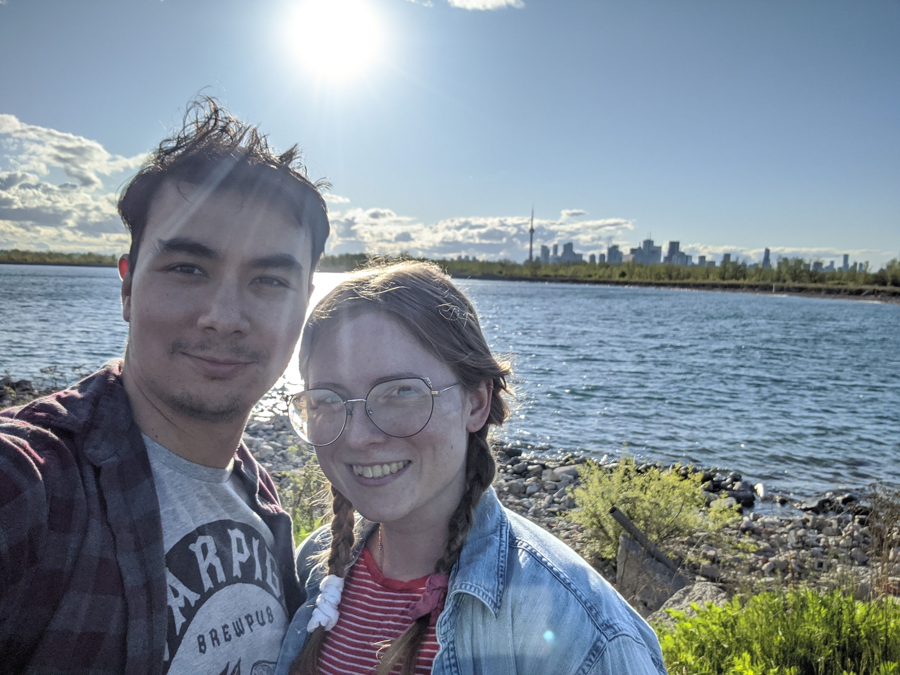

# Engineers

## Ryan Collins (@ryancollins) - rycollins@vmware.com

Howdy!

I'm Ryan and I'm the initial creator of this workshop, so if you love it, you're welcome! If you don't like it, then Peter did it.

I was hired by Pivotal Sofware in November 2015 which was acquired by VMware in 2020. I currently live in Toronto, Ontario with my fiancée Jesse and our two hounds; Gunther (big) and Gertie (little).

I come from a background of pair programming and love to meet new people, so don't hesitate at all to reach out if you have questions. Or even just to have a cup of coffee and a chat!